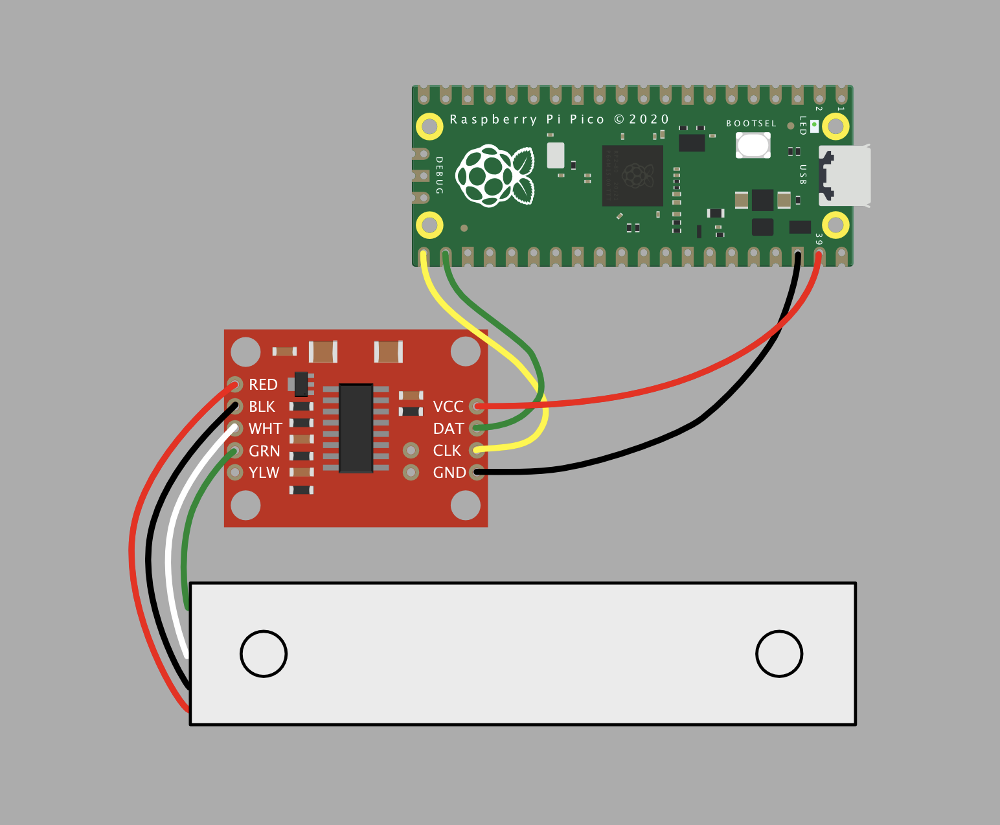
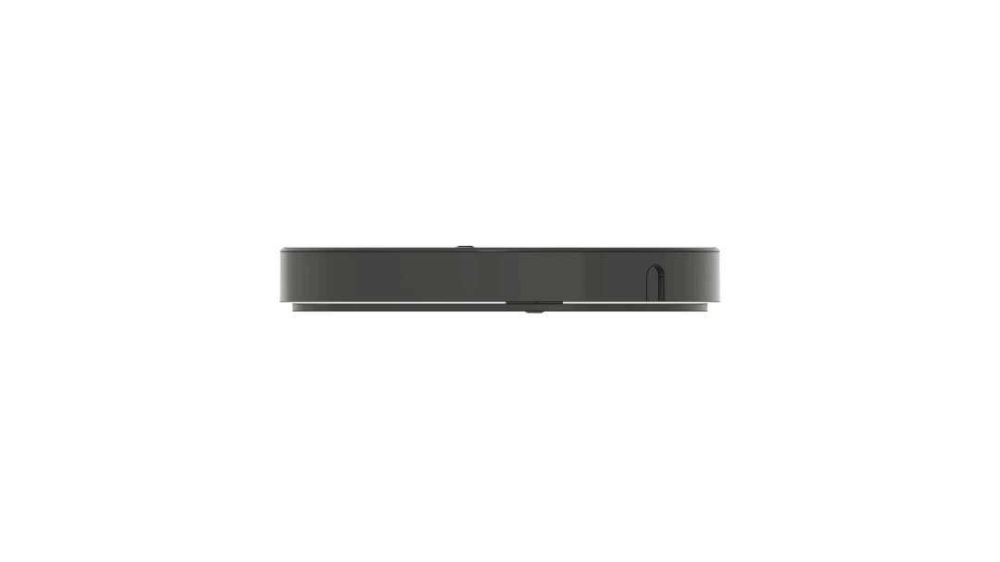

# 💧🐕 Home Assistant Dog Bowl Water Level Sensor <!-- omit in toc -->

- [Materials](#materials)
- [3D Printing](#3d-printing)
- [Construction](#construction)
- [Programming](#programming)
- [Calibration](#calibration)
- [Home Assistant](#home-assistant)
- [Credits](#credits)

# Materials

You'll need the following to build the sensor:

| Item | Quantity |
| --- | --- |
| Raspi Pico W | 1 |
| 3D printed base | 1 |
| M5 x 12 mm screw | 2 |
| [TAL220B Load Cell](https://www.sparkfun.com/products/14729) | 1 |
| [HX711 Load Sensor Amplifier](https://www.sparkfun.com/products/13879) (any HX711 board will do) | 1 |

# 3D Printing

You'll need to 3D print the top and bottom of the scale. I recommend printing with PETG since the scale body might get wet while in use.

## *STLs* <!-- omit in toc -->

STL files are included in the `base` folder for the top and bottom of the scale. The scale top has a diameter of 180 mm. If that is too big or small for your dog's bowl, you'll have to modify the model.

## *Fusion360* <!-- omit in toc -->

A fusion360 model is also located in the `base` folder. The model has a user parameter `ScaleDiameter` that can be changed to suit the size of your dog's bowl.

# Construction

1) Wire up the Raspi Pico W and the HX711 load sensor amplifier as shown below:

2) Assemble the scale by inserting the load cell between the scale bottom and the scale top and securing with the M5 screws:

# Programming

1) Set up an MQTT Broker with Home Assistant (e.g., the [Mosquitto add-on](https://github.com/home-assistant/addons/blob/master/mosquitto/DOCS.md)).
2) Install Micropython on the Raspi Pico W. Instructions [here](https://www.raspberrypi.com/documentation/microcontrollers/micropython.html).
3) Fill out WiFi SSID, WiFi password, MQTT server (or IP address), MQTT username, and MQTT password in [secrets-template](lib/secrets-template.py).
4) Rename [secrets-template](lib/secrets-template.py) file to `secrets`.
5) Mount Raspi Pico W as flash drive on computer. Put `main.py` and `lib` folder on the Raspi Pico W. You can also open in VSCode and upload to the board with the [Pico-Go extension](http://pico-go.net).

# Calibration

1) First, get the raw value of the scale with nothing on it (you can use the `Raw value` output in the serial console when nothing is on the scale). Replace `loadCellZeroValue` in the config variable section with this value.
2) Next, get the raw value of the scale with something you know the weight of in grams (you can weigh something with another scale). The calculate `loadCellScalingFactor` according to the following formula: `scaleRawValueWithKnownWeight * loadCellScalingFactor = knownWeight`. Replace `loadCellScalingFactor` in the config variable section with this value.
3) Finally, get the scaled value of the scale with your dog's bowl on it (you can use the `Scaled value` output in the serial console when your dog's bowl is on the scale). Replace `emptyBowlWeight` with this vaulue in the config variable section with this value.
# Home Assistant

The sensor will be automatically added to Home Assistant via MQTT discovery.

# Credits

- [HX711 Micropython library](https://github.com/SergeyPiskunov/micropython-hx711) by Sergey Piskunov
- [MQTT Micropython library](https://github.com/fizista/micropython-umqtt.robust2) by fizista
